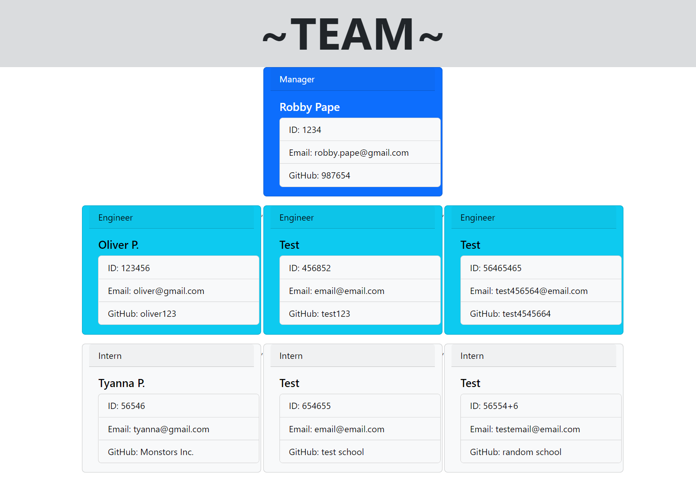

Project Title: Team-Profile-Generator

Project Description: This interactive application takes in the dependencies of inquirer and jest. This application is for a manager inputting their information along with their engineers and inters information. It give them the option to add as many employees as needed. Once completed it will generate a styled HTML document with all the inputted information. This application also has classes that all pass their test cases. 
 
 Link: https://github.com/RPAPE3/Team-Profile-Generator

Screenshot: 
